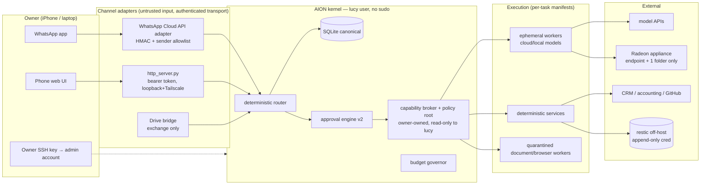

# 03 — Threat Model, Security Findings and Hardening Sequence

Audit date 2026-09-16. Applies to the LucyOS control plane (Mark-2 today), the office inference appliance (if qualified), channels, and workers.

## 1. Security findings (evidence-backed)

| ID | Severity | Finding | Evidence | Fix |
|---|---|---|---|---|
| S-01 | P0 | Root remote-shell service in the architecture: `systemd/mark2-desktop-commander.service` runs `npx --yes @wonderwhy-er/desktop-commander@0.2.48 remote` as root with `HOME=/root` on the controller. General terminal/filesystem control through a third-party relay on the host holding canonical state and the secret file. | unit file in repo; `scripts/install_desktop_commander.sh` enables it | OD-03: owner disables it (`systemctl --user disable --now mark2-desktop-commander.service`), then LQ-11 removes the unit from the repo. Replacement for remote admin: owner SSH key over Tailscale to a non-Lucy admin account. |
| S-02 | P0 | Execution boundary is a string-prefix allowlist in front of `subprocess.run(shell=True)`. Before this audit `echo x; rm -rf ~/openclaw` or `echo $(cat secrets.env)` passed the check. Plans that feed `exec_command` are written by cloud models from task descriptions, i.e. reachable by prompt injection. | `worker.check_command` (pre-3126ff1) | Partial blocklist landed in commit 3126ff1 (`;`, `$(`, backtick, `|bash`, home wipes, sudo/ssh/wget…). Full fix LQ-01: shlex parse, argv[0] allowlist, no shell, cwd/path confinement. |
| S-03 | P0 | Everything runs as root on Mark-2 (`/root/lucyos`, `/root/openclaw`, `PATH=/root/.local/bin` in units). No separate service identity; any worker bug or injection is root. | unit files, `MASTER_AI_HANDOFF.md` | LQ-10 non-root `lucy` user; ADR-20. |
| S-04 | P0 | Backups are same-disk, unencrypted tar.gz; `private_state` (all secrets, Drive service-account file, rclone config) has no backup at all. Disk loss or ransomware = total loss of secrets and last 14 days of state; DO weekly image is the only off-host copy (REPORTED enabled, first image not observed as of 8 Sep). | `backup.py`, `OPERATIONS.md` | LQ-02 restic + encrypted `private_state` backup; OD-05 target. |
| S-05 | P0 | Both repos are public. History of `lucyos-` is clean of secrets (verified), but the repo carries the owner's mission text, revenue targets, Upwork proposal drafts, and will attract business data if `work/` keeps growing. `strategy-factory` history unverified. | GitHub API 2026-09-16 | OD-01; LQ-04 scans strategy-factory history before/after flip. Also: never commit `work/` business artifacts to a public repo (LQ-08 adds a `.gitignore` guard for `work/leads`). |
| S-06 | P1 | Approval authority = channel token. `router.handle` trusts `sender`; the generic webhook adapter defaults `sender="owner"` and runs unauthenticated if the bridge token is unset (warns, continues). No expiry, no scope binding on approvals. | `router.py`, `whatsapp_bridge.run_webhook`, `approvals.py` | LQ-06 approval v2 + refuse to start the webhook adapter without a token; the Cloud adapter (signature + allowed sender) is the only production inbound path. |
| S-07 | P1 | Whole secret file is exported into the bridge environment (`set -a; . secrets.env`). Any code in the bridge process (and any child) sees every credential. | `aion-bridge.service` | Broker handles (ADR-06). Interim: split per-service env files and load only the needed names per unit (LQ-10 does this while creating the `lucy` user). |
| S-08 | P1 | `agents.allowed_tools` and `capabilities` are inert metadata; the registry names `openclaw` an "orchestrator" with `fs,git,shell,http`. Nothing enforces it, which is safe today but misleading to future maintainers and models reading the DB. | grep | LQ-07 rename + comment; LQ-14 real manifests. |
| S-09 | P1 | No CI. The pre-commit hook is optional and local; a bad push reaches `main` unchecked. | no `.github/` | LQ-03. |
| S-10 | P2 | `curl -s http://localhost` prefix also matches `http://localhost.evil.tld`; `bash scripts/` allows `bash scripts/../x`. | `worker.DEFAULT_ALLOWED` | Folded into LQ-01. |
| S-11 | P2 | Interface/bridge bind to loopback (good) but remote access design relies on "use Tailscale Serve"; no documented Tailscale ACL/grant. | `OPERATIONS.md` | Phase 1 hardening step H-6. |
| S-12 | P2 | Ollama listens on 11434; on Mark-2 it is loopback (REPORTED). If the Radeon appliance exposes it, host firewall + Tailscale identity restriction are mandatory. | design | ADR-07 gate. |
| S-13 | INFO | Drive bridge is fail-closed and well-designed; Google Drive API disabled in project is a functional, not security, blocker. Drive is exchange-only, cannot grant approvals (verified in code comments and tests). | `drive_bridge.py` | none |

## 2. Trust boundaries

Boundary rules:
1. Everything left of the kernel is data. Text from a channel, a document, a webpage or a model output never becomes policy.
2. Only the broker executes side effects. Workers get handles, never values.
3. Policy root (`policy/*.json`, broker code, unit files) is writable only by the owner-admin account. Hash checked at boot; mismatch ⇒ safe mode.
4. The appliance and cloud GPUs receive prompts and files from one folder; they never receive credentials or the canonical DB.
5. The final backup chain is deletable only with an owner-held credential.

## 3. Authority bands (GREEN / AMBER / RED) in AION terms

| Band | Examples | Mechanism |
|---|---|---|
| GREEN — automatic | read/search state; run tests; hash/dedupe; classify/extract into quarantine tables; write under `ARTIFACTS/<task>`; create backups; draft messages (not send); create tasks/approvals; local/cloud model calls within daily cap on INTERNAL data; git commit on a feature branch | broker ALLOW; audited |
| AMBER — standing policy | send a pre-approved template message to the owner; renew a known subscription ≤ policy cap; cloud GPU ≤ ₹X/day with idle-kill; push to `main` after green CI; call CRM/accounting *write* APIs for idempotent field updates inside a named policy; cloud model calls on CONFIDENTIAL data to allow-listed providers | broker checks named policy + counters; audited; owner digest |
| RED — fresh owner approval | any money movement/transfer; new subscription or vendor; spend above cap; real-capital trade or broker API change; contract/legal representation; disclosing credentials; deleting a backup chain; opening a port / weakening firewall / changing policy files or bands; changing ownership/control of any account; irreversible deletion; public exposure (repo visibility, publishing); outreach to a new external party; production deploy that changes schema | approval object v2, expiring, scoped; executed only via broker citing the approval |

Law: Lucy may improve her implementation (GREEN branch work) but may not change the files that define the bands, budgets, allowlists or policy root. Those changes are RED and applied by the owner.

## 4. Threat register (likelihood over 2–5 y / impact / detection / containment / prevention / recovery)

| Threat | L | I | Detection | Containment | Prevention | Recovery |
|---|---|---|---|---|---|---|
| Prompt-injected webpage/PDF/email requests privileged action | High | High | broker DENY events; anomaly: worker requests outside manifest | manifest deny; task parked | external text is data; quarantine parsers; no standing grants to research workers | revoke task grants; review events; re-run from checkpoint |
| Poisoned RAG/document data | Med | High | claim contradiction map; source authority class | claim stays `unverified` | provenance schema; two-source rule for consequential claims | mark superseded; recompute |
| Compromised ephemeral worker (model or runtime) | Med | High | manifest violations; unexpected egress | per-task grants expire; network allowlist | ephemeral; least privilege; no secrets in context | rotate handles used by that task; audit |
| Malicious dependency / supply chain | Low-Med | Critical | SBOM + advisories; CI | pinned versions; no `npx --yes`; no auto community skills | stdlib-only kernel (keep!); review any new dep; Trivy in CI | rollback; rotate |
| Credential theft (token, service account) | Med | Critical | auth_failed events; provider alerts | scoped, short-lived tokens; per-service files | broker; no secrets in git/chat/logs; passkeys/2FA | rotate; revoke; postmortem |
| Phishing of owner (fake approval card) | Med | High | approval object mismatch (nonce/scope) | decision must reference a live object | typed approvals; dashboard confirm for RED | deny; rotate channel token |
| Ransomware / disk loss on controller | Med | Critical | backup age alert; integrity check | off-host append-only copy | restic 3 copies; non-root; no remote shell | clean-host restore (drilled quarterly) |
| Device/VPS theft or account takeover | Low-Med | Critical | provider login alerts | full-disk encryption (on-prem); DO 2FA | FDE; 2FA; separate admin identity | rebuild from backup; rotate everything |
| Insider/owner error (wrong approval) | Med | Med-High | approval scope + expiry | single-action hold | reversible-first design; cost/downside on card | compensating action |
| Remote access compromise (Tailscale/SSH) | Low-Med | Critical | login logs | ACL grants; no password auth | keys only; separate admin account; no exposed ports | rotate keys; rebuild |
| Model hallucination in legal/finance/BOQ | Med | Critical | citation/constraint checks; deterministic arithmetic | outputs are drafts pending review | authoritative-source retrieval; professional sign-off gates | correct record; notify affected decisions |
| Unsafe autonomous action (legit credential, wrong decision) | Med | High | AMBER counters; digest | band model; single-task hold | RED list; idempotency; reversibility-first | compensating action; postmortem |
| Token/cloud runaway loop | Med-High | High | governor; attempt caps; spend meter | STOP state; kill idle GPU | downshift-only governor; attempt cap (ADR-09) | park tasks; root-cause |
| Cloud data exfiltration (worker sends CONFIDENTIAL to wrong provider) | Med | High | classification on packet; net allowlist | broker denies | privacy-first routing | rotate; notify |
| Backup corruption / restore fails | Med | Critical | monthly restic check; quarterly drill | 3 copies | drill; checksums | alternate copy |
| Silent data duplication/corruption (SF lesson) | Med | Critical in finance | invariants: unique keys, calendar checks, reconciliation | fail-closed on invariant | idempotency keys; immutable raw evidence | recompute from raw |
| Provider outage | High | Med | health | deterministic core keeps running | adapters; alternate provider | park dependent tasks |
| Controller failure | Med | High | heartbeat missing | — | portable export; documented rebuild | restore on new host ≤ RTO |
| WhatsApp/channel compromise | Low-Med | High | sender rejected events; unusual commands | GREEN-only via channel; RED needs object | sender allowlist; HMAC | rotate tokens; pause |
| Owner unreachable | High | Med | approval age | queue holds only RED tasks; GREEN/AMBER continue | design | none needed |
| Alert fatigue | High | Med | owner response rate | digest batching | P0–P3 classes | tune |
| Self-modifying policy | Low (if built right) | Critical | policy hash mismatch at boot | safe mode | owner-owned policy root | restore policy from git |

## 5. Prioritized hardening sequence

| Step | Action | Who | Band | Task |
|---|---|---|---|---|
| H-1 | Disable desktop-commander; confirm no other remote-control agents on Mark-2 | owner | RED | OD-03, LQ-05 (inventory) |
| H-2 | Decide repo visibility; make private if agreed; scan strategy-factory history | owner + worker | RED | OD-01, LQ-04 |
| H-3 | Off-host encrypted backups incl. `private_state`; first clean restore | worker + owner (target creds) | GREEN build / RED creds | LQ-02, OD-05 |
| H-4 | Argv-based command boundary (no shell) | worker | GREEN | LQ-01 |
| H-5 | Non-root `lucy` service user; per-service env files; owner admin separate | owner runs script | RED (security boundary) | LQ-10 |
| H-6 | Host firewall default-deny; Tailscale ACL grant owner→controller only; SSH keys only | owner | RED | runbook in execution package §8 Phase 1 |
| H-7 | Approval v2 (scope, expiry, authenticated channel); refuse unauthenticated webhook | worker | GREEN | LQ-06 |
| H-8 | Capability manifest schema + broker skeleton; policy root hash at boot | worker (spec by architect) | GREEN | LQ-14, LQ-20 |
| H-9 | CI with tests + secret scan + Trivy | worker | GREEN | LQ-03 |
| H-10 | Quarantined document parsing path for the first workflow | worker | GREEN | LQ-18 |
| H-11 | Radeon isolation audit before any CONFIDENTIAL data | worker + owner | AMBER | LQ-12 |
| H-12 | Tabletop incident drill + kill-switch test; write `docs/INCIDENT_RUNBOOK.md` | owner + worker | GREEN | Phase 3 exit |

## 6. Incident response (short form)

isolate (pause + safe mode + stop timers) → revoke/rotate the affected handles → preserve `events` export and logs → determine affected data/actions from events → restore from verified snapshot if state is suspect → patch root cause with a regression test → postmortem note in `MEMORY/lessons` → re-enable autonomy band by band.
