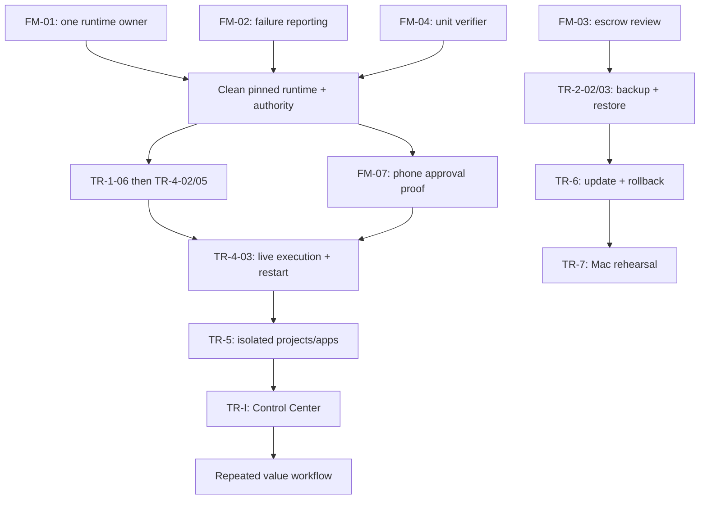

# Dependency and collision plan
This supplements existing TR work orders; it is not a new operational task queue.
First batch ready for bounded work: FM-01 read-only; FM-02 isolated code; FM-03 synthetic security review; FM-04 isolated extraction; FM-05 read-only; FM-06 one-row semantic review.
Do not launch production dispatch while FM-01 is unresolved.

Native LucyNest lane: FM-05 -> TR-3-03 inactive source -> UI-1 asset comparison -> read-only native smoke -> G7. Decision-authority expansion needs its own review; camera diagnosis can run separately until paths overlap.

Conflict locks: one worker.py writer (TR-1-06 -> TR-4-02 -> TR-4-05 -> TR-5-06); one schema writer (TR-4-02 -> TR-4-05 -> TR-5-02); cli.py changes from escrow/executor/project/interface are integrated serially even if independently developed. No overlapping authority edits; re-freeze after the final reviewed protected batch. No deployment promotion while candidate code or schema changes.
TR-5-01 -> 5-02 -> {5-03,5-04,5-06,5-07}; serialize actual shared-file edits despite DAG independence. 5-04 -> 5-05; 5-02..07 -> TR-8-04. TR-I-01 -> I-02; scoped UI waits for 5-03.
TR-2-01 -> 6-02; FM-04/TR-6-03 -> 6-04; backup/restore + 6-04 + TR-7-01 -> 7-02 -> 7-03.
TR-8-01 -> 8-02; phone proof -> 8-03; first workflow selected explicitly before G10.
Cleanup is parallel only for disjoint files and never blocks core operation solely to empty the branch list.

Existing 55 orders are preserved in reused_work_orders/ as historical source packets at the base. They are NOT all dispatch-ready: this supplement overrides stale statuses, missing context and unsafe parallelism. Finish the current small batch before expanding packets; unresolved exact-file mappings stay HOLD, not guessed.
